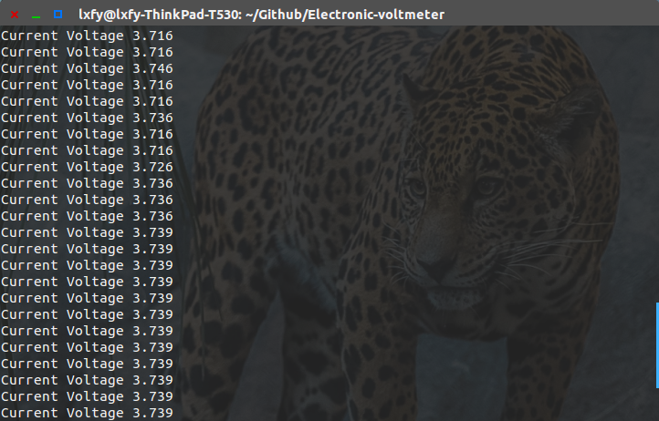
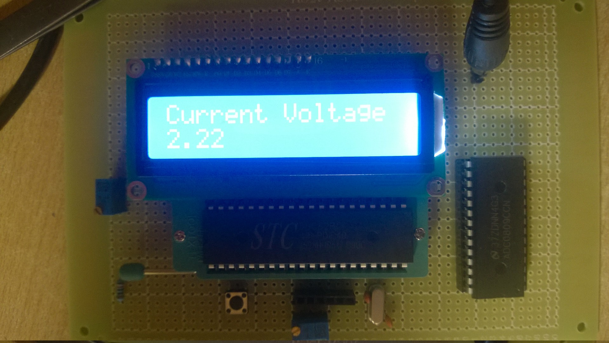

# Electronic-voltmeter
[中文说明](http://www.luoxufeiyan.com/2016/03/09/electronic-voltmeter/)

Do it yourself. Design a electronic voltmeter based on `STC89C51` and `ADC0809`. 
You can monitor it on your PC or smartphone via bluetooth!

This is what you willing to get finally.

### You Need

All acquired items listed [here](https://github.com/luoxufeiyan/Electronic-voltmeter/blob/feature/hardware/Bill.of.Materials.pdf)

You may need these softwares (Acquired Windows OS)
* Proteus
* Altium Designer
* Keil

All codes included in `software/` dir. You can find my PCB file in `hardware/` dir.

### License

GPL
